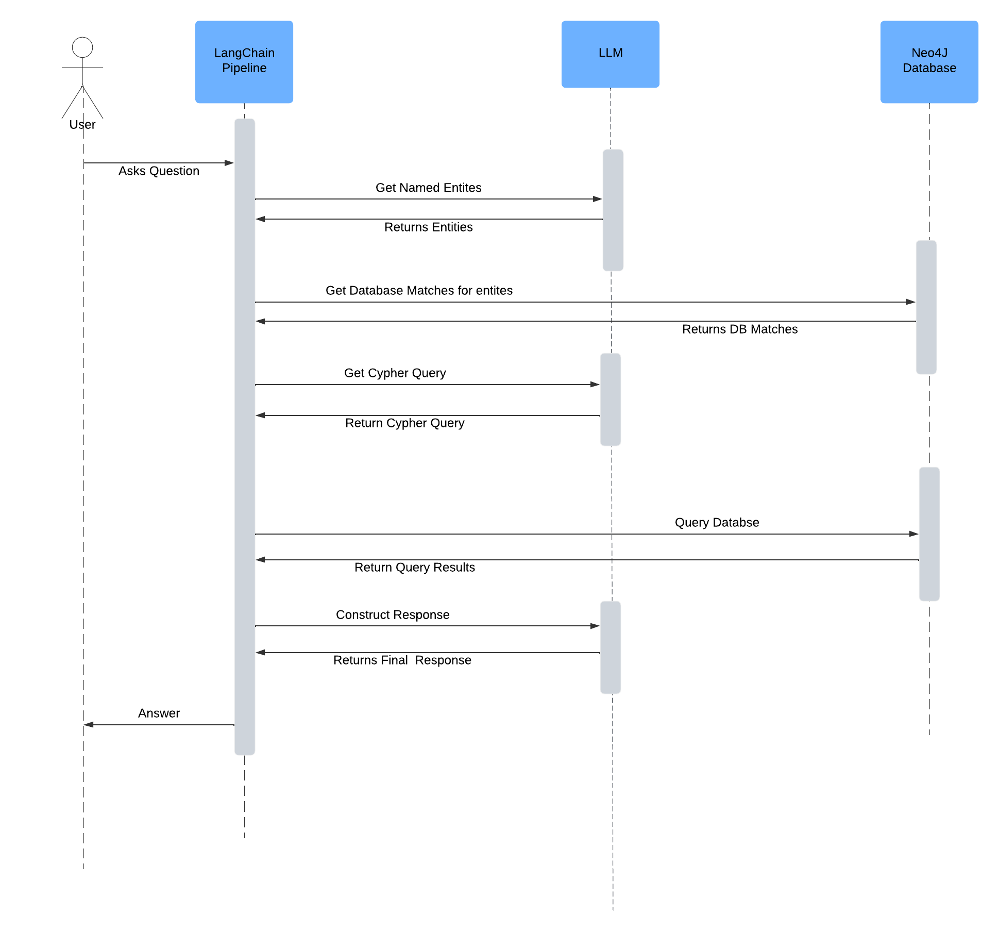

# EduQuery

## Local Setup
1. Install Requirements using ```pip install -r requirements.txt```
2. Setup Environment Variables: File ```dummy.env``` has the template for keys. Rename the file to ```.env``` after adding the api keys and let it be in the same root folder.
   * You have to set up API keys for Neo4j and Gemini LLM API
   * ```./config/app_config.yaml``` has the app settings like choice of LLM  
     * If you want use OpenAI models instead, set ```use_llm: openai``` in this file 
     * OPTIONAL: 
     * If you want to use a different LLM:
       1. Add the config like other LLMs in ```./config/app_config.yaml``` 
       2. Setup API keys for the new LLM in ```.env```
       3. And LLM initialization code in ```./src/llm/llm_core.py: LLMFactory``` class
3. Setup Database: 
   1. If you are setting up the Neo4j Database for the first time, you need to install the
   2. Run the script ```python scripts/setup_neo4j.py``` to populate the Knowledge Graph DB 

The demo has both CLI mode
* For the CLI mode: run ```python demo.py``` use ```--verbose``` for tracing the pipeline 


### Knowledge Graph Schema 


#### Why Graph DB over Relational DB? 
* This was a design decision based on the following points:  
* As the use-cases grow, capturing more complicated relationships will be easier in KG
  * Example: Group Projects, Prerequisites, TAs etc. 
* Graph DBs provides flexible Schema
* Graph DBs can traverse relationships faster than SQL joins. 

## How does the pipeline work?



## Directions for Expansion 
1. Adding more courses 
   * This is already supported. Just put more course folders in data folder and run ```python scripts/setup_neo4j.py```
   * This will skip any course folders that are already processed. 
   * Will not duplicate actors nodes like Student nodes and Instructor nodes (assuming they all have a unique id like in any university)
2. Using More Examples for LLM
   * As the number of examples increase we can add an example sector module which dynamically loads examples from a vector store.
   * In the ```src/datamodel/graph_db.py: CypherQueryRepository``` load the examples in a vector store
   * Add the API keys for the vector store in ```.env``` file and application level configurations in ```config/app_config.yaml```
   * Create a class to use these configuraitons in ```src/api_keys.py```
   * Use ```SemanticSimilarityExampleSelector``` in Step 3 of the pipeline ```src/pipeline/edu_query.py```
   * Similarly select an encoder model for encoding the example questions and setup API keys and App configs in the same way as explained 
3. Use a different backend database
   * Setup DB code in ```src/datamodel``` module. Use ```graph_db.py``` for reference 
   * Create a new pipeline in ```/src``` directory. The abtract class ```src/pipeline/edu_query: EduQuery```. Follow ```src/graph_pipeline.py``` for reference.


## Tech Stack: 
1. Neo4J 
2. LangChain 
3. Python 
4. Google Gemini LLM


