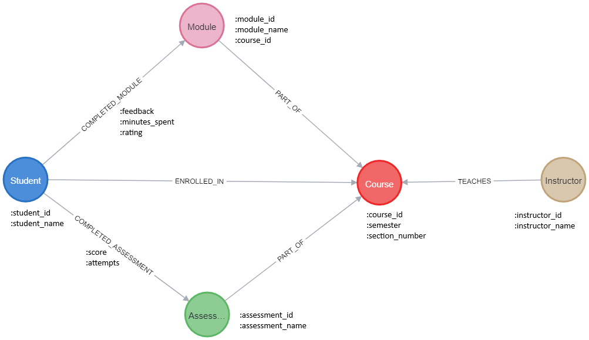

# EduQuery

## Want to skip the setup and try the demo? 
[Link]()

## How to setup the project for a demo in you Local System?
1. Install Requirements using ```pip install -r requirements.txt```
2. Setup Environment Variables: File ```dummy.env``` has the template for keys. Rename the file to ```.env``` after adding the api keys and let it be in the same root folder.
   * You have to set up API keys for Neo4j and Gemini LLM API
   * ```./config/app_config.yaml``` has the app settings like choice of LLM  
     * If you want use OpenAI models instead, set ```default_llm: openai``` in this file 
     * OPTIONAL: 
     * If you want to use a different LLM:
       1. Add the config like other LLMs in ```./config/app_config.yaml``` 
       2. Setup API keys for the new LLM in ```.env```
       3. And LLM initialization code in ```./src/llm/llm_core.py: LLMFactory``` class
3. Setup Database: 
   1. If you are setting up the Neo4j Database for the first time, you need to install the
   2. Run the script ```python src/create_database.py``` to populate the Knowledge Graph DB 

The demo has both CLI mode and Web Model 
* For the CLI mode: run ```python src/pipeline.py```
* For the web Mode: run ```streamlit run demo.py```


## How does the pipeline work?

### 1. Data model
## Knowledge Graph Schema 

#### Why Graph DB over Relational DB? 
* This was a design decision, I could have used a relational DB instead but I considered the following points:  
* As the use-cases grow, capturing more complicated relationships will be easier in KG
  * Example: Group Projects, Prerequisites, 
* DB migrations are relatively easy in KG 

### 2. NER 
### 3. DB Matching
### 4. Semantic Layer 
### 5. Few-Shot Examples 
### 6. Response

## Tech Stack: 
1. Neo4J 
2. LangChain 
3. Python 
4. Google Gemini LLM 
5. Streamlit (Web Demo)

## Project Organization  


